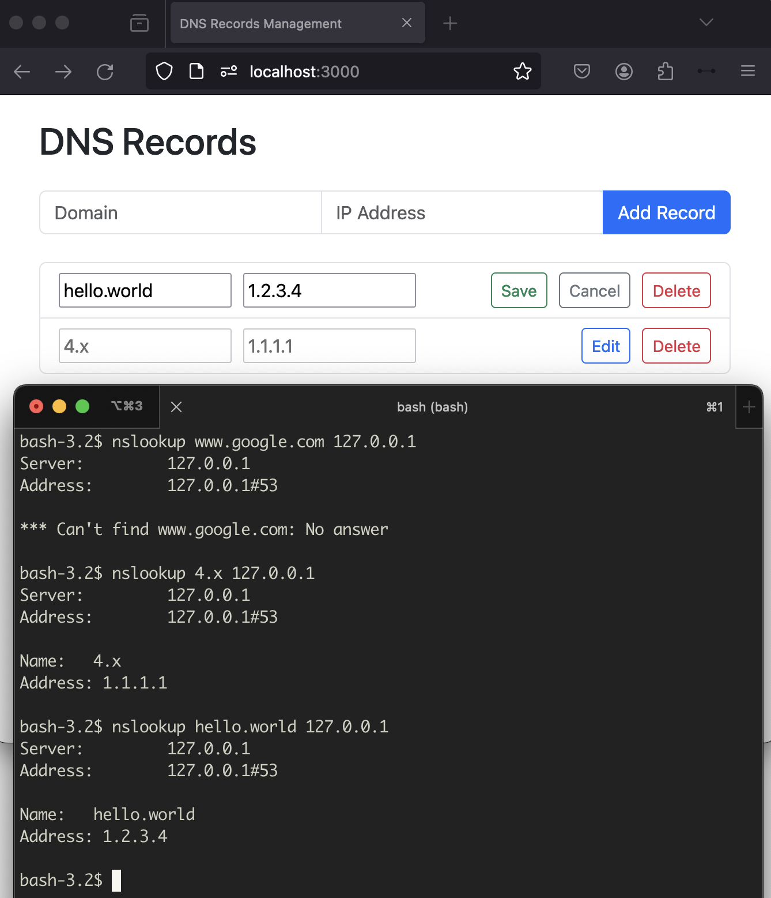

homedns
----

A DNS server with a webui to CRUD DNS records(only support A records).  
The code of the project is generated by ChatGPT.

## Usage

```bash
docker build -t homedns .
echo '{}' >> data.json
docker run -d --name homedns -p 53:53/udp -p 3000:3000 -v $(pwd)/data.json:/data.json -e DNS_RECORDS_FILE=/data.json homedns
```

Open http://127.0.0.1:3000 to add some DNS records and run `nslookup your.domain.name 127.0.0.1` to test it.

## Screenshot

